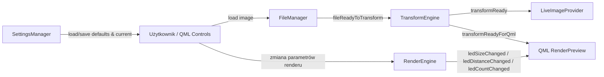

# Spectral Display GUI

## Spectral Display GUIProject overview
PL: Spectral Display GUI to aplikacja desktopowa oparta o Qt5 i QML, zaprojektowana do pracy z obrazem wejściowym i jego transformacją do reprezentacji użytecznej w wizualizacji LED. Narzędzie pozwala użytkownikowi wczytać plik graficzny, wskazać parametry przekształcenia oraz obserwować wynik w postaci podglądu renderowania. Głównym celem projektu jest połączenie prostego, czytelnego interfejsu z backendem C++, który wykonuje właściwe obliczenia i udostępnia je warstwie QML w czasie zbliżonym do rzeczywistego. W praktyce oznacza to szybkie iterowanie ustawień takich jak liczba punktów LED, rozmiar pojedynczego punktu, odległość między punktami czy prędkość obrotu podglądu.

Architektura aplikacji rozdziela odpowiedzialności między komponenty: `FileManager` odpowiada za obsługę plików, `TransformEngine` realizuje przetwarzanie obrazu, `RenderEngine` zarządza parametrami i stanem podglądu renderu, `SettingsManager` dba o trwałość i walidację konfiguracji, a `LiveImageProvider` przekazuje aktualny obraz do interfejsu. Taki podział upraszcza rozwój, testowanie i utrzymanie kodu. Projekt zawiera gotowe presety CMake (debug/release/ut/benchmark), testy jednostkowe i skrypty wspierające codzienną pracę zespołu: budowanie, formatowanie i raportowanie coverage. Dzięki temu repozytorium może pełnić zarówno rolę aplikacji użytkowej, jak i stabilnej bazy do dalszych eksperymentów z algorytmami transformacji, pipeline’em renderowania oraz integracją C++/QML.

-------------------------------------------------------------------------------------------------

EN: Spectral Display GUI is a Qt5/QML desktop application focused on loading source images, transforming them, and previewing LED-style rendering output. The project is built to provide an efficient workflow where a user can quickly adjust transformation and rendering parameters, immediately inspect visual results, and repeat the process without leaving the application context. In practical terms, the UI exposes controls such as LED count, LED size, spacing, angular behavior, and rotation speed, while the C++ backend performs the heavier processing and exposes state changes back to QML.

The codebase is intentionally structured around clear component boundaries: `FileManager` handles file I/O, `TransformEngine` executes image transformation logic, `RenderEngine` maintains rendering-preview parameters, `SettingsManager` persists and validates configuration, and `LiveImageProvider` delivers generated images to the QML layer. This separation keeps the system easier to reason about and improves maintainability as features evolve. The repository also includes practical engineering tooling: CMake presets for debug, release, unit tests, and benchmarks; test targets for verification; and helper scripts for build, formatting, and coverage. As a result, the project serves not only as an application but also as a solid technical foundation for iterative development, experimentation with transformation algorithms, and reliable C++/QML integration in a real desktop workflow.

## 1) Wymagania

- Linux (testowane na Ubuntu)
- `cmake >= 3.23`
- `ninja-build`
- kompilator C++17 (`g++`/`clang++`)
- Qt5 (Core, Gui, Quick, QuickControls2, QML)

Przykładowa instalacja (Ubuntu/Debian):

```bash
sudo apt update
sudo apt install -y \
  cmake ninja-build build-essential \
  qtbase5-dev qtdeclarative5-dev qtquickcontrols2-5-dev \
  qml-module-qtquick-window2 qml-module-qtquick-controls \
  qml-module-qtquick-controls2 qml-module-qtquick-dialogs \
  qml-module-qtquick-layouts
```

W niektórych starszych środowiskach można spotkać metapakiet `qt5-default`, ale preferowana jest instalacja jawnych pakietów jak wyżej.

## 2) Build i uruchamianie

Projekt korzysta z presetów CMake (`CMakePresets.json`).

### Debug

```bash
cmake --preset debug
cmake --build --preset debug
./build/debug/bin/BasicGUI
```

### Release

```bash
cmake --preset release
cmake --build --preset release
./build/release/bin/BasicGUI
```

### Szybki build przez skrypt

```bash
./scripts/linux_build.sh debug
# lub
./scripts/linux_build.sh release
```

### Instalacja do `GUI_portable` w katalogu głównym repozytorium

```bash
cmake --preset install
cmake --build --preset install
cmake --build --preset install --target install
```

Wariant debug (także do `GUI_portable`):

```bash
cmake --preset install-debug
cmake --build --preset install-debug
cmake --build --preset install-debug --target install
```

Wynik instalacji:

- `README.md`
- `GUI_portable/README.md`
- `GUI_portable/bin/BasicGUI`
- `GUI_portable/bin/qt.conf` (lokalne ścieżki Qt dla trybu portable)
- `GUI_portable/lib/` (runtime biblioteki Qt wymagane przez aplikację)
- `GUI_portable/plugins/` (m.in. `platforms`, `imageformats`, `platformthemes`, `xcbglintegrations`)
- `GUI_portable/qml/` (moduły QML wymagane przez Qt Quick/Controls)
- `GUI_portable/skrypts/` (`run_portable.sh`, `run_portable_debug.sh`)
- `GUI_portable/documentation/` (kopia katalogu dokumentacji)
- `GUI_portable/spectral_display_portable.tar.gz` (archiwum `tar.gz` tworzone przez `cmake --install`)

Uruchamianie wersji portable:

```bash
./scripts/run_portable.sh
```

Uruchamianie wersji portable (debug):

```bash
./scripts/run_portable_debug.sh
```

## 3) Testy jednostkowe

Włączone przez preset `ut`.

```bash
cmake --preset ut
cmake --build --preset ut
ctest --test-dir build/ut --output-on-failure
```

## 4) Coverage

```bash
./scripts/coverage.sh
```

Raport HTML jest generowany w katalogu `build/coverage/`.

Uwaga: konfiguracja coverage pomija `main/app/source/main.cpp`.

## 5) Formatowanie kodu

### C/C++ (`clang-format`)

- styl: `./.clang-format`
- formatowanie całego projektu:

```bash
./scripts/format.sh --apply
```

- tylko check (bez zmian):

```bash
./scripts/format.sh --check
```

### QML (`qmlformat`)

Przykład ręcznie:

```bash
qmlformat -i main/app/qml/RenderPart/RenderPreview.qml
```

## 6) VS Code – formatowanie przy zapisie

W repo jest gotowa konfiguracja workspace:

- `/.vscode/settings.json`
- `/.vscode/extensions.json`

Aktualne zasady:

- C/C++: `clang-format` przez rozszerzenie `xaver.clang-format`
- QML i QML types (`*.qml`, `*.qmltypes`): `qmlformat` przez `emeraldwalk.runonsave`
- JS w ścieżkach QML: `prettier` (jeśli dostępny)

## 7) Struktura repo (skrót)

- `main/` – kod aplikacji (`BasicGUI`)
- `tests/` – testy jednostkowe/benchmarki
- `scripts/` – skrypty pomocnicze (build, format, coverage)
- `utils/` – narzędzia CMake i wsparcie testów
- `documentation/` – dodatkowe materiały

## 8) Typowe problemy

- **Brak Qt/QML modułów**: doinstaluj pakiety Qt5 z sekcji „Wymagania”.
- **Brak `clang-format`**: `sudo apt install clang-format`.
- **Brak `qmlformat`**: doinstaluj narzędzia Qt Declarative dla swojej dystrybucji.

## 9) Architektura aplikacji

### Główne komponenty

- `FileManager` – ładowanie i zapis plików graficznych, emisja sygnałów do dalszego przetwarzania.
- `TransformEngine` – transformacja obrazu (na podstawie parametrów i punktu selekcji), publikacja obrazu wynikowego.
- `RenderEngine` – przygotowanie parametrów pod render preview i synchronizacja wartości dla QML.
- `RenderSelector` – komponent zaznaczenia punktu/obszaru w podglądzie.
- `SettingsManager` – walidacja i zapis/odczyt ustawień projektu.
- `LiveImageProvider` – dostarczanie aktualnego obrazu do warstwy QML (`image://live/...`).
- QML (`main.qml`, `RenderControl.qml`, `RenderPreview.qml`) – UI, kontrolki i podgląd renderu.

### Przepływ danych (QML/C++)



### Kluczowe sygnały

- `FileManager::fileReadyToTransform(QPixmap)`
- `TransformEngine::transformReady(std::shared_ptr<QImage>)`
- `TransformEngine::transformReadyForQml()`
- `RenderEngine::ledSizeChanged()`
- `RenderEngine::ledDistanceChanged()`
- `RenderEngine::ledCountChanged()`

### Uruchomienie i rejestracja w `main.cpp`

W `main/app/source/main.cpp` obiekty backendu są tworzone i wystawiane do QML przez `QQmlContext`:

- `file_manager`
- `settings_manager`
- `transform_engine`
- `process_monitor`

Dodatkowo rejestrowane są typy QML:

- `RenderEngine` jako `Main 1.0 / RenderEngine`
- `RenderSelector` jako `Main 1.0 / Selector`
